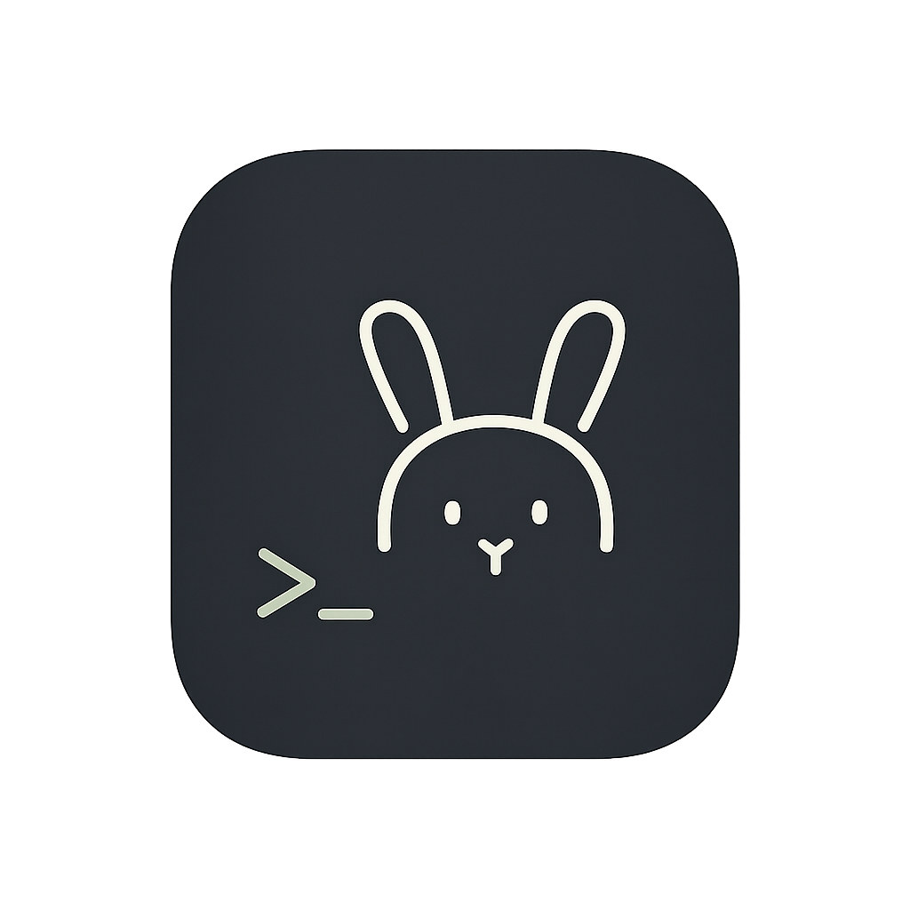

# Rabbitty

  
  
Fast, lean, cross-platform terminal emulator.

> Warn: This is a work-in-progress project.

Rabbitty is a terminal emulator chasing `foot`-like memory thrift and cross-platform speed, with feature-ful and polish.

- Lean memory: small, steady footprint even with deep scrollback.
- Fast paths: low-latency rendering and input.
- Cross-platform: consistent on macOS, Linux, Windows.
- Featureful and fancy: tabs, themes, and modern UX without bloat.

## Goals

- [ ] SSH Managing
- [ ] Plugin support with wasm
- [ ] Easy changing theme
- [ ] Easy file upload & download with SFTP
- [ ] Split terminal in single tab
